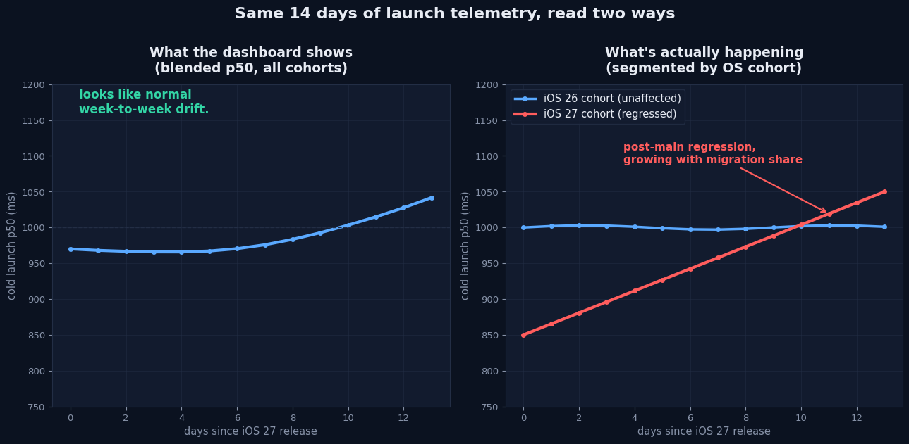

# LaunchCohort

A tiny Swift library — plus a runnable SwiftUI demo — that answers one question your launch-time dashboard almost certainly can't right now:

**Is the platform's launch-time win hiding a regression you shipped?**

iOS 27 made pre-main launch work roughly 20–30% faster fleet-wide. That's real, and it's good news. But a blended, unsegmented launch-time percentile can't tell the difference between "the OS got faster" and "my own post-main code got slower, and the OS win is currently paying for it." `LaunchCohort` segments launch samples by OS-version cohort, computes bounds-checked percentiles per cohort, and flags when a cohort's own trend diverges from the blended trend by more than a threshold — the exact shape of "masked regression" a platform migration produces.

This repo is the demo companion to the Medium article *(added after publish)*.

## What it shows

Two telemetry windows — last week and this week — read two ways:



Segmented by OS cohort, the picture changes completely. The blended fleet p50 moves a modest +5%. The iOS 27 cohort specifically — now the majority of the fleet — moved +23.5%. That's the masked regression `RegressionMasking.detect` exists to catch:

```swift
public static func detect(
    trends: [CohortTrend],
    blendedDeltaFraction: Double,
    threshold: Double = 0.10
) -> [MaskedRegressionFinding] {
    let safeThreshold = max(threshold, 0)
    let findings = trends.compactMap { trend -> MaskedRegressionFinding? in
        let divergence = trend.deltaFraction - blendedDeltaFraction
        guard divergence > safeThreshold else { return nil }
        return MaskedRegressionFinding(
            cohort: trend.cohort,
            cohortDeltaFraction: trend.deltaFraction,
            blendedDeltaFraction: blendedDeltaFraction
        )
    }
    return findings.sorted { $0.divergence > $1.divergence }
}
```

Every percentile call is bounds-checked and nil-safe — no force-unwraps, and a cohort with fewer than `minimumCohortSampleSize` (5) samples returns `nil` instead of a percentile computed from noise:

```swift
static func percentile(_ p: Double, of values: [TimeInterval]) -> TimeInterval? {
    guard !values.isEmpty else { return nil }
    let clampedP = min(max(p, 0), 1)
    let sorted = values.sorted()
    let rawIndex = clampedP * Double(sorted.count - 1)
    let index = min(max(Int(rawIndex.rounded()), 0), sorted.count - 1)
    return sorted[index]
}
```

## Demo app

`Demo.xcodeproj` is a SwiftUI app that consumes the `LaunchCohort` package (as a local Swift package reference, same repo, so cloning this one repo and opening `Demo.xcodeproj` is the whole setup) and renders exactly the scenario above: a synthetic two-week fleet migration with a real masked regression, the blended p50 card, the per-cohort trend list, and the flagged finding.

### How to run it

1. Clone this repo.
2. Open `Demo.xcodeproj` in Xcode.
3. Pick any iOS Simulator destination.
4. Build & Run (⌘R). No other setup, no API keys, no external services.

### Verification status

- `swift build` and `swift test` both run clean from this repo's root: **24 tests, 0 failures** (`LaunchSampleTests`, `LaunchCohortStoreTests`, `RegressionMaskingTests`, `LaunchTelemetrySummaryTests`), verified on Swift 6.1 (Linux toolchain, since this pipeline runs in a Linux sandbox).
- **The live iOS Simulator run was skipped this run.** Before touching Xcode, this pipeline checks what's already on screen — and this time Xcode had a real, unrelated project open and actively debugging (a different app, mid-session, streaming live telemetry). Per this pipeline's own safety rule, it backed off immediately rather than risk disturbing that work, and is disclosing the skip here plainly instead of implying a Simulator screenshot exists. `Demo/Screenshots/` accordingly contains generated diagram and code-card images for the article, **not** a Simulator screenshot of the running app. The SwiftUI view compiles as part of the package graph and was reviewed by hand (see the quality-gate note in this repo's release notes), but "compiles" is not being represented as "ran on a Simulator."

## Library structure

```
Sources/LaunchCohort/
  LaunchSample.swift            — one measured launch, tagged with OS version
  LaunchCohortStore.swift       — records samples, computes blended/cohort percentiles
  RegressionMasking.swift       — detects cohorts whose trend diverges from the blend
  LaunchTelemetrySummary.swift  — ties the two together into one baseline-vs-current call
Tests/LaunchCohortTests/        — 24 tests covering the happy path and the edge cases
Demo/                           — SwiftUI app + DemoApp.swift entry point
Demo.xcodeproj/                 — consumes LaunchCohort via a local package reference
```

## Why this exists

Apple's iOS 27 pre-main optimizations are a genuine platform win — but a launch dashboard that only reads a single blended percentile can't see a regression that a fast-growing cohort is currently absorbing. This library is the minimum viable fix: segment first, then read the number.

---

*Built as a demo companion to a Medium article on why an unearned platform-level performance win is an observability incident, not a gift.*
